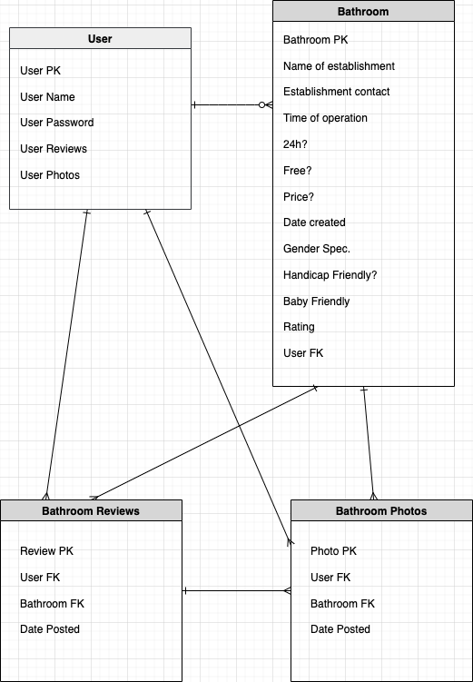
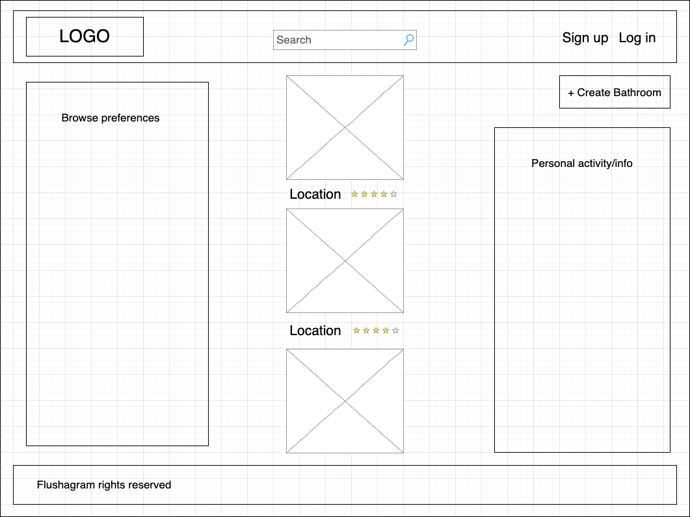
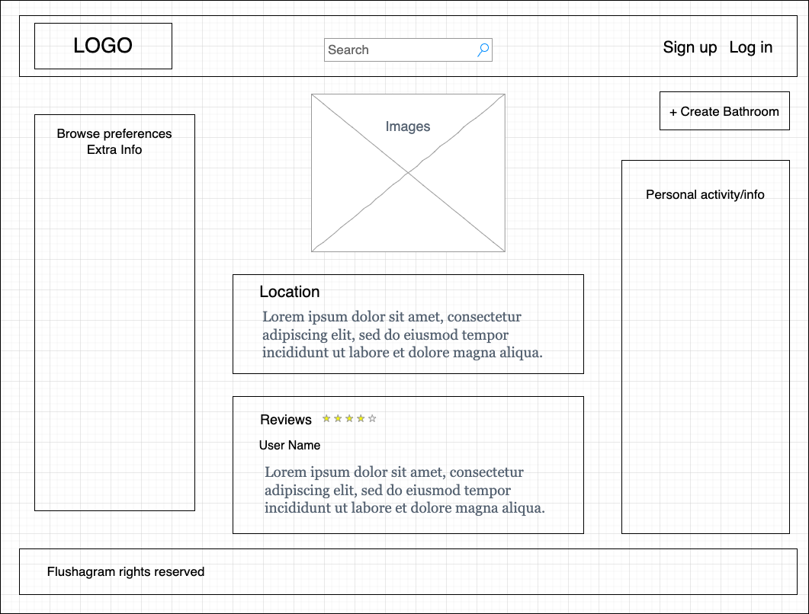

# [MyFlush](https://myflush.herokuapp.com//)

:-------------------------:|
  |

Find the nearest public Bathroom.

## Technologies

- HTML
- CSS
- Materialize
- Python 3
- Django

## ERD

Opening            | 
:-------------------------:|
  |

## Wireframes

Opening            | 
:-------------------------:|
  |

Starships Info            | 
:-------------------------:|
  |

**Summary**

| Field | Detail |
|-------|--------|
| App Name | MyFlush |
| Description | Find the nearest public Bathroom |
| Live Website | https://myflush.herokuapp.com/ |
| Repo | https://github.com/germanokuerten/myflush |

>"Simplicity Is the key to brilliance." - Bruce Lee